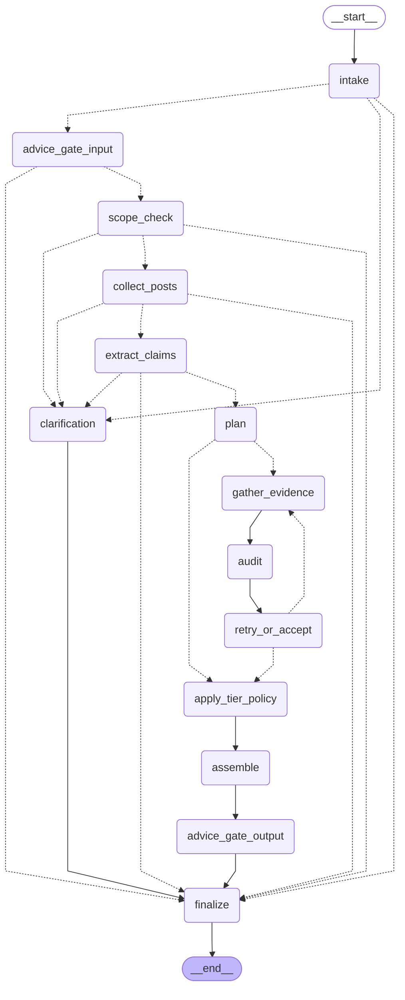

# FinSight orchestrator graph

Generated by `finsight graph` (finsight.agents.orchestrator.graph.export_mermaid). Do not edit by hand.

```mermaid
---
config:
  flowchart:
    curve: linear
---
graph TD;
	__start__([<p>__start__</p>]):::first
	intake(intake)
	advice_gate_input(advice_gate_input)
	scope_check(scope_check)
	clarification(clarification)
	collect_posts(collect_posts)
	extract_claims(extract_claims)
	plan(plan)
	gather_evidence(gather_evidence)
	audit(audit)
	retry_or_accept(retry_or_accept)
	apply_tier_policy(apply_tier_policy)
	assemble(assemble)
	advice_gate_output(advice_gate_output)
	finalize(finalize)
	__end__([<p>__end__</p>]):::last
	__start__ --> intake;
	advice_gate_input -.-> finalize;
	advice_gate_input -.-> scope_check;
	advice_gate_output --> finalize;
	apply_tier_policy --> assemble;
	assemble --> advice_gate_output;
	audit --> retry_or_accept;
	clarification --> finalize;
	collect_posts -.-> clarification;
	collect_posts -.-> extract_claims;
	collect_posts -.-> finalize;
	extract_claims -.-> clarification;
	extract_claims -.-> finalize;
	extract_claims -.-> plan;
	gather_evidence --> audit;
	intake -.-> advice_gate_input;
	intake -.-> clarification;
	intake -.-> finalize;
	plan -.-> apply_tier_policy;
	plan -.-> gather_evidence;
	retry_or_accept -.-> apply_tier_policy;
	retry_or_accept -.-> gather_evidence;
	scope_check -.-> clarification;
	scope_check -.-> collect_posts;
	scope_check -.-> finalize;
	finalize --> __end__;
	classDef default fill:#f2f0ff,line-height:1.2
	classDef first fill-opacity:0
	classDef last fill:#bfb6fc
```
